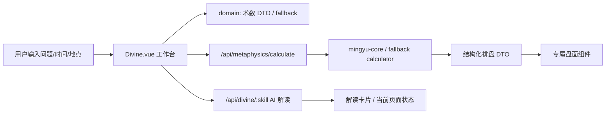

# 玄学排盘工作台 MVP 架构

## 系统架构

当前项目保留 Vue 3 + Vite 前端和 Pages/Netlify Function API，不在本次 MVP 中引入重型后端框架。



核心原则：

- 盘面优先：提交后先显示结构化排盘，AI 文字慢或失败时不影响用户看到结果。
- DTO 稳定：每个术数有自己的 `domain/*` 归一化层，后端真实算法和前端 fallback 都输出同一结构。
- 组件专属：奇门用九宫盘，梅花用本卦/互卦/变卦/体用盘，避免所有工具退化成同一种文字卡。
- 隐私优先：默认不写浏览器本地记录，也不自动写远端数据库；后续保存/分享必须由用户主动触发。

## 文件结构

```text
frontend/
  src/
    api/divine.js
    components/
      MeihuaBoard.vue
      QimenBoard.vue
      RitualState.vue
    domain/
      meihua.js
      qimen.js
    views/
      Divine.vue
  functions/api/[[path]].js
docs/
  metaphysics-workbench-mvp.md
  metaphysics-workbench-schema.sql
  qimen-mvp-architecture.md
  qimen-mvp-schema.sql
```

## 数据库设计

MVP 不强制上线数据库，但生产环境建议增加统一记录表：

- `id`: UUID
- `user_id`: 可空，匿名用户为空
- `skill`: `bazi | ziwei | qimen | liuyao | meihua | ...`
- `question`: 用户问题
- `input_payload`: 表单快照 JSON
- `chart_dto`: 结构化盘面 JSON
- `ai_answer`: AI 解读文本
- `status`: `pending | completed | failed`
- `created_at`, `updated_at`

详见 `docs/metaphysics-workbench-schema.sql`。

## API 接口

### POST `/api/metaphysics/calculate`

请求：

```json
{
  "skill": "meihua",
  "datetime": "2026-07-06T20:44",
  "place": "杭州 / 东南",
  "topic": "合作/项目",
  "question": "今天 15:36 听到三声响，想问项目是否顺利。"
}
```

响应：

```json
{
  "ok": true,
  "skill": "meihua",
  "source": "mingyu-core",
  "data": {
    "meta": {
      "solar": "2026-07-06 20:44",
      "lunar": "由算法按起课时间换算",
      "topic": "合作/项目",
      "place": "杭州 / 东南",
      "method": "数字 / 时间 / 外应起卦"
    },
    "original": { "label": "本卦", "name": "乾为天", "note": "初始态势" },
    "mutual": { "label": "互卦", "name": "天泽履", "note": "过程暗线" },
    "changed": { "label": "变卦", "name": "天风姤", "note": "变化结果" },
    "relation": {
      "body": "体卦",
      "use": "用卦",
      "text": "体用生克",
      "movingLine": "五爻动"
    },
    "clues": []
  }
}
```

### POST `/api/divine/:skill`

保持现有流式 AI 解读接口不变。它负责解释，不负责决定盘面是否可见。

## UI 架构

`Divine.vue` 是术数工作台容器：

- 左栏：术数导航。
- 中栏：顶部说明、维度筛选、输入表单、实时盘面、结果列表。
- 右栏：填写提示、隐私说明、推荐功能。

专属盘面组件：

- `BaziBoard.vue`: 四柱八字专业表格，支持真实行列 DTO 和 fallback。
- `ZiweiBoard.vue`: 紫微斗数十二宫圆盘，支持 `palaces + meta + center`。
- `QimenBoard.vue`: 奇门九宫 DTO 渲染。
- `LiuyaoBoard.vue`: 六爻线盘，支持阴阳爻、世应、动爻、六亲。
- `MeihuaBoard.vue`: 梅花本卦/互卦/变卦/体用 DTO 渲染。
- `DaliurenBoard.vue`: 大六壬圆形课盘，支持十二支、神将、三传、四课摘要。
- `XiaoliurenBoard.vue`: 小六壬六宫圆盘。
- `FengshuiBoard.vue`: 风水九宫方位盘。
- `TarotBoard.vue`: 塔罗牌阵卡片布局。
- 后续新增术数时遵循同样结构：`domain/{skill}.js` + `{Skill}Board.vue` + `render{Skill}Board()`。

统一归一化层：

- `frontend/src/domain/metaphysics.js` 负责八字、紫微、六爻、大六壬、小六壬、风水、塔罗的 DTO 归一化。
- `frontend/src/domain/qimen.js` 和 `frontend/src/domain/meihua.js` 保留更复杂的专属领域模型。
- 组件 Props 统一为 `data: Object`，组件内部调用对应 `normalize*Board()`，因此后端真实算法字段变动时，优先改归一化层，不改 UI 组件。

## 验收标准

- `/divine/meihua` 进入页面即显示梅花专属盘面，不再是纯文字块。
- `/divine/bazi`、`/divine/ziwei`、`/divine/qimen`、`/divine/liuyao`、`/divine/meihua`、`/divine/daliuren`、`/divine/xiaoliuren`、`/divine/fengshui`、`/divine/tarot` 均显示各自专属盘面组件，不退回通用文字格。
- 修改起课时间、地点、事件类型或问题后，预览盘面会变化。
- 提交后真实 API 返回的数据仍使用同一组件展示。
- 桌面端三栏布局不重叠，移动端回到单列。
- `npm run build` 通过。
