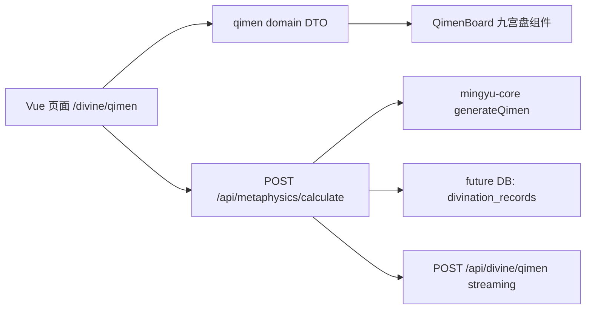

# 奇门遁甲 MVP 架构

## 系统架构



MVP 目标是先把奇门排盘做成稳定、可复用、可扩展的子系统：前端先渲染本地兜底盘，后端可用时用真实排盘数据替换，AI 解读只补充文字，不决定盘面是否可见。

## 文件结构

```text
frontend/src/domain/qimen.js            # 奇门 DTO、兜底盘、后端数据归一化
frontend/src/components/QimenBoard.vue  # 九宫盘可视化组件
frontend/src/views/Divine.vue           # 页面编排、表单、提交、AI 解读
frontend/src/api/divine.js              # calculateChart / divineStream API 客户端
frontend/functions/api/[[path]].js      # Cloudflare Pages API /metaphysics/calculate
docs/qimen-mvp-architecture.md          # 架构与接口说明
docs/qimen-mvp-schema.sql               # 可选数据库 schema
```

## 数据库设计

MVP 当前不强依赖数据库，也不会把排盘记录保存在浏览器本地。生产版本如需新增 `divination_records` 表，必须以用户主动点击“保存/分享”作为前提，并在 UI 中明确提示将写入远端；`chart_payload` 保存规范 DTO，`ai_summary` 保存流式解读结果。

## API 接口

### POST `/api/metaphysics/calculate`

请求：

```json
{
  "skill": "qimen",
  "datetime": "2026-07-06T16:58",
  "topic": "合作/项目",
  "place": "北京"
}
```

响应：

```json
{
  "ok": true,
  "skill": "qimen",
  "source": "mingyu-core@0.1.8",
  "data": {
    "center": { "time": "2026-07-06 16:58", "topic": "合作/项目", "place": "北京" },
    "meta": { "solar": "2026-07-06 16:58", "lunar": "甲辰年 四月十四 巳时", "juShu": "阳遁三局" },
    "cells": [
      ["巽四宫", "杜门", "天辅星", "九天", "乙", "丙", "东南"]
    ]
  }
}
```

## UI 架构

- 页面层：`Divine.vue` 只负责收集表单、请求 API、组织结果。
- 领域层：`domain/qimen.js` 负责把后端数组/对象/缺省值统一成九宫 DTO。
- 组件层：`QimenBoard.vue` 只接收 `data`，渲染顶部信息、九宫格、方位、底部摘要。
- 状态层：`RitualState.vue` 处理加载、空、错误，避免业务组件里散落状态 UI。

## MVP 验收

- `/divine/qimen` 首屏右侧必须出现九宫盘，不允许只出现文本列表。
- `.qimen-grid` 必须包含 9 个 `.qimen-cell`。
- 后端失败时仍显示本地兜底九宫盘。
- 桌面和 390px 移动端无页面级横向溢出。
