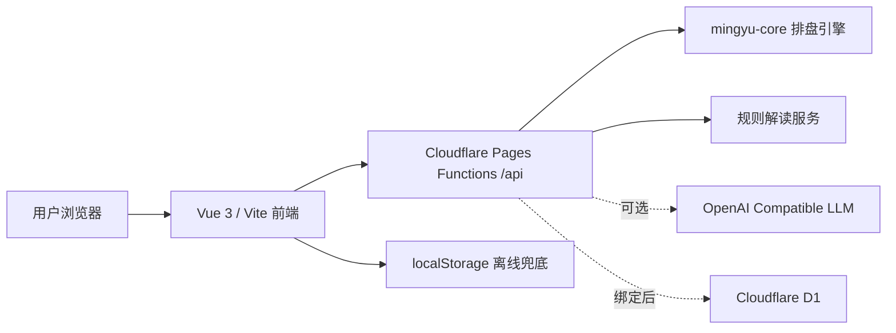

# 乾坤之道创业项目 MVP 架构

## 系统架构

目标是把当前网站做成可运行、可部署、可扩展的玄学文化娱乐 MVP。第一阶段不迁移技术栈，保持 Cloudflare Pages 一体化部署，减少运维复杂度。



核心原则：

- 前端先生成可视化盘面，AI/规则解读随后补充，避免后端慢或失败时页面空白。
- `/api/divine/:skill` 不再依赖旧 Netlify 站点；没有模型 Key 时使用结构化规则解读。
- `/api/consultations` 面向 D1 持久化；未绑定 D1 时明确返回 `persistence_unavailable`，前端降级到本地记录。
- 分享页 `/share/:id` 是最小增长闭环：用户可保存记录，后续绑定 D1 后可分享。

## 文件结构

```text
frontend/
  functions/api/[[path]].js          # Cloudflare Pages API：健康检查、排盘、解读、咨询记录
  src/api/divine.js                  # 前端 API SDK：排盘、流式解读、记录保存/读取
  src/views/Divine.vue               # 核心问卦工作台，接入保存记录
  src/views/ShareView.vue            # 分享/记录详情页
  src/router/index.js                # 路由，包含 /share/:id
  src/components/AsyncBoundary.vue   # 异步状态边界
  src/components/RitualState.vue     # 加载/空/错/提示状态组件
docs/
  startup-mvp-architecture.md        # 当前文档
  startup-mvp-schema.sql             # D1 数据库 schema
```

## 数据库设计

生产数据库建议使用 Cloudflare D1。

核心表 `consultations`：

| 字段 | 类型 | 说明 |
| --- | --- | --- |
| `id` | TEXT PK | 记录 ID，可用于分享 URL |
| `client_id` | TEXT | 浏览器匿名客户端 ID |
| `skill` | TEXT | 术法类型 |
| `title` | TEXT | 最近记录和详情页标题 |
| `question` | TEXT | 用户问题 |
| `payload_json` | TEXT | 表单参数快照 |
| `board_json` | TEXT | 排盘结果快照 |
| `reading` | TEXT | 解读文本 |
| `created_at` | TEXT | 创建时间 |
| `updated_at` | TEXT | 更新时间 |

预留表 `product_events` 用于后续分析转化漏斗，例如开始排盘、完成排盘、保存记录、分享点击、付费入口点击。

## API 接口

| 方法 | 路径 | 说明 |
| --- | --- | --- |
| `GET` | `/api/health` | 健康检查，返回运行时和数据库绑定状态 |
| `GET` | `/api/divine/skills` | 获取术法列表 |
| `POST` | `/api/metaphysics/calculate` | 调用 `mingyu-core` 生成结构化盘面 |
| `POST` | `/api/divine/:skill` | SSE 流式解读，优先模型，失败后规则解读 |
| `POST` | `/api/consultations` | 保存咨询记录 |
| `GET` | `/api/consultations?clientId=&limit=` | 读取当前客户端最近记录 |
| `GET` | `/api/consultations/:id` | 读取分享详情 |

`POST /api/consultations` 请求：

```json
{
  "clientId": "web_xxx",
  "skill": "qimen",
  "title": "奇门遁甲 · 合作项目",
  "question": "这周是否适合推进合作？",
  "payload": {},
  "board": {},
  "reading": "结构化解读文本"
}
```

未绑定 D1 时响应：

```json
{
  "ok": false,
  "code": "persistence_unavailable",
  "record": {}
}
```

前端收到该响应后继续保存到 localStorage，不打断用户流程。

## UI 架构

- `Divine.vue` 是核心工作台，负责表单、排盘、流式解读、保存记录。
- 专业盘面由 `BaziBoard`、`ZiweiBoard`、`QimenBoard`、`MeihuaBoard` 等组件承载。
- `AsyncBoundary` 统一加载、空、错、成功状态，避免动态数据散落在页面里。
- `ShareView.vue` 使用同一套 `AsyncBoundary` 读取详情，保证分享页具备错误和空状态。

## 部署

构建：

```powershell
cd E:\CodexWork\yulesuangua-ui\yulesuangua\frontend
$env:npm_config_cache='E:\npm-cache'
npm run build
```

部署：

```powershell
npx wrangler pages deploy dist --project-name yulesuangua --branch main
```

D1 初始化：

```powershell
wrangler d1 create yulesuangua-prod
wrangler d1 execute yulesuangua-prod --file ..\docs\startup-mvp-schema.sql
```

在 Cloudflare Pages 项目里绑定 D1，binding 名称必须为 `DB`。可选模型环境变量：

- `OPENAI_API_KEY` / `OPENAI_BASE_URL` / `OPENAI_MODEL`
- 或 `NVIDIA_API_KEY` / `NVIDIA_BASE_URL` / `NVIDIA_MODEL`

没有模型环境变量时，MVP 仍会返回规则解读。

## 当前 MVP 边界

- 已具备问卦、排盘、解读、记录保存、最近记录、分享详情的技术闭环。
- 还没有账号、支付、后台管理和正式订单系统。
- D1 未绑定时线上仍可使用，但分享详情需要数据库后才能跨设备访问。
